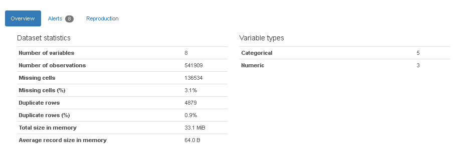
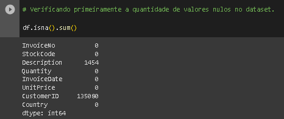
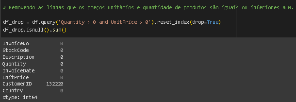
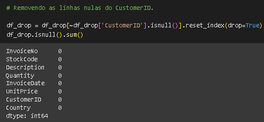
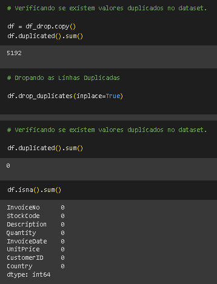
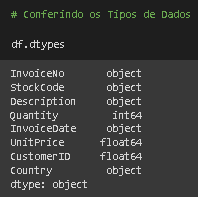
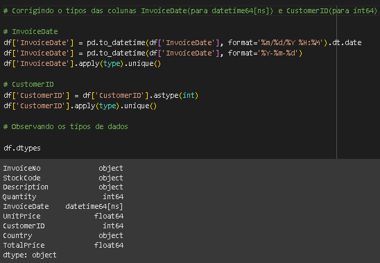

# Preparando um dataset para modelagem de dados

## Contexto:

Uma empresa do ramo de e-commerce contratou você para levantar os indicadores de
recência, frequência e ticket médio (RFM) dos seus clientes.
A saber RFM:
 - R (Recency): Tempo que o cliente realizou a última compra (em dias)
 - F (Frequency): Quantidade de compras realizadas pelo cliente
 - M (Monetary): Valor do ticket médio gasto pelo cliente
onde ticket médio = média do total gasto por pedido para cada cliente.
Para isso, vocês receberam uma base de dados (arquivo csv) e devem construir um
código em Python que gera um output também csv, porém contendo apenas a
identificação do cliente e métricas RFM.

## Sobre os dados:

A tabela contém informações de compras de um e-commerce em 37 países. Contém a
identificação do cliente e os dados da compra.

| Coluna      | Descrição   | 
|-------------|-------------|
CustomerID    | Código de identificação do cliente
Description   | Descrição do produto             
InvoiceNo     | Código da fatura                   
StockCode     | Código de estoque do produto      
Quantity      | Quantidade do produto             
InvoiceDate   | Data do faturamento (compra)       
UnitPrice     | Preço unitário do produto         
Country       | País da compra                    

## Lendo e inspecionando os dados:

Está etapa foi feita ultilizando o "ProfileReport" para ter um parâmetro geral sobre a base de dados.

Com isso é possivel ter um bom parâmetro sobre a base, com informações como Número de Variáveis, Células faltantes em número e em porcentagem, Linhas Duplicadas em número e em porcentagem. Também é possivel ver os tipos das variáveis e a distribuição dos dados.

## Tratamento de Dados(Valores Nulos):

Verificando os valores nulos com o "isna" e utilize a função "sum" para a somar
a quantidade de nulos.

É possivel ver 299 Valores Nulos na coluna "Description", 34935 Valores Nulos na coluna "CustomerID" e 1 Valor Nulo na coluna "Country"

**Preços unitários e quantidade de produtos iguais ou inferior a 0**

**Linhas nulas do CustomerID.**

Aqui temos os valores nulos totalmente zerados, conforme verificamos acima.

## Tratamento de Dados(Valores Duplicados):

Veridicando se existem dados duplicados através da função "duplicated" e dropando-as.

Após esta etapa temos os valores duplicados removidos e a base sem dados nulos conforme vimos um pouco acima.

## Corrigindo os tipos de dados.

**Tipos de dados:**

É possível observar alguns erros: "InvoiceDate" está como "object" quando deveria estar como "datetime64[ns]" e "CustomerID" está como "float64" quando deveria estar como "int64". Vamos corrigi-los logo em seguida.

**Corrigindo Tipos:**

Podemos observar que os dados foram devidamente corrigidos.

